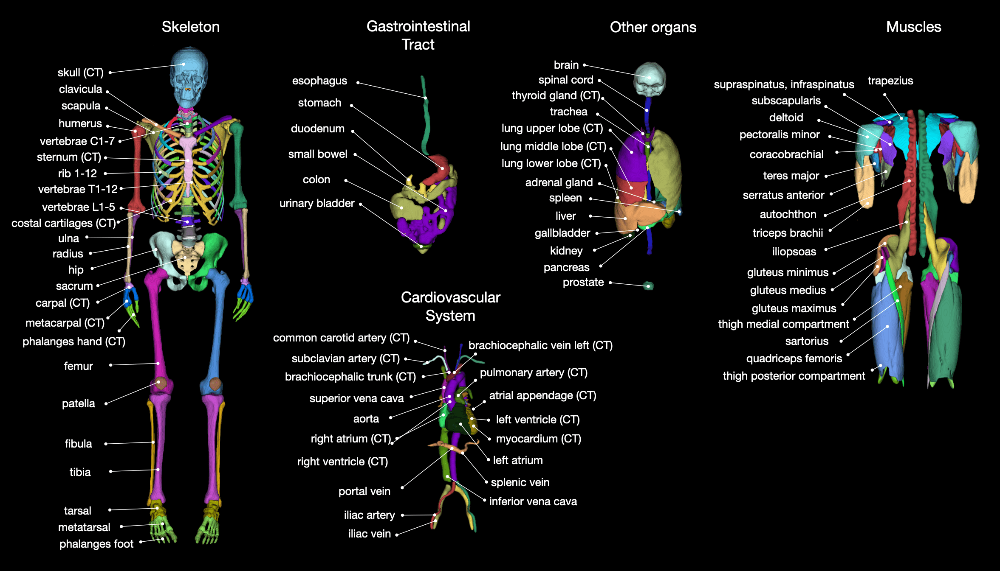
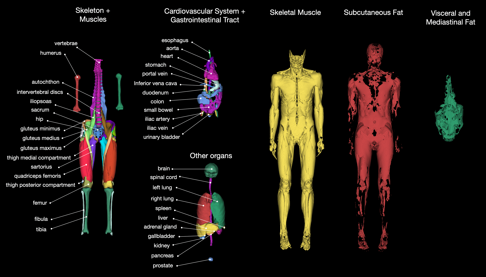

# TotalSegmentator

Tool for segmentation of most major anatomical structures in any CT or MR image. It was trained on a wide range of different CT and MR images (different scanners, institutions, protocols,...) and therefore should work well on most images. A large part of the training dataset can be downloaded here: [CT dataset](https://doi.org/10.5281/zenodo.6802613) (1228 subjects) and [MR dataset](https://zenodo.org/doi/10.5281/zenodo.11367004) (298 subjects). You can also try the tool online at [totalsegmentator.com](https://totalsegmentator.com/) or as [3D Slicer extension](https://github.com/lassoan/SlicerTotalSegmentator).

**ANNOUNCEMENT: We created a platform where anyone can help annotate more data to further improve TotalSegmentator: [TotalSegmentator Annotation Platform](https://annotate.totalsegmentator.com).**

Main classes for CT: 


Main classes for MR: 


See [here](https://backend.totalsegmentator.com/find-task/) for all available structures.

Created by the department of [Research and Analysis at University Hospital Basel](https://www.unispital-basel.ch/en/radiologie-nuklearmedizin/forschung-radiologie-nuklearmedizin).
If you use it please cite our [Radiology AI paper](https://pubs.rsna.org/doi/10.1148/ryai.230024) ([free preprint](https://arxiv.org/abs/2208.05868)). If you use it for MR images please cite the [TotalSegmentator MRI paper](https://arxiv.org/abs/2405.19492). Please also cite [nnUNet](https://github.com/MIC-DKFZ/nnUNet) since TotalSegmentator is heavily based on it.


### Installation

TotalSegmentator works on Ubuntu, Mac, and Windows and on CPU and GPU.

Install dependencies:
* Python >= 3.9
* [Pytorch](http://pytorch.org/) >= 2.0.0 (and <2.4 for windows)

Optionally:
* if you use the option `--preview` you have to install xvfb (`apt-get install xvfb`) and fury (`pip install fury`)


Install Totalsegmentator
```
pip install TotalSegmentator
```


### Usage
For CT images:
```
TotalSegmentator -i ct.nii.gz -o segmentations
```
For MR images:
```
TotalSegmentator -i mri.nii.gz -o segmentations --task total_mr
```
> Note: A Nifti file or a folder (or zip file) with all DICOM slices of one patient is allowed as input.

> Note: If you run on CPU use the option `--fast` or `--roi_subset` to greatly improve runtime.

> Note: This is not a medical device and is not intended for clinical usage.


### Subtasks


Next to the default task (`total`) there are more subtasks with more classes. If the taskname ends with `_mr` it works for MR images, otherwise for CT images.

Openly available for any usage:
* **total**: default task containing 117 main classes (see [here](https://github.com/wasserth/TotalSegmentator#class-details) for a list of classes)
* **total_mr**: default task containing 56 main classes on MR images (see [here](https://github.com/wasserth/TotalSegmentator#class-details) for a list of classes)
* **lung_vessels**: lung_vessels (cite [paper](https://www.sciencedirect.com/science/article/pii/S0720048X22001097)), lung_trachea_bronchia
* **body**: body, body_trunc, body_extremities, skin
* **body_mr**: body_trunc, body_extremities (for MR images)
* **vertebrae_mr**: sacrum, vertebrae_L5, vertebrae_L4, vertebrae_L3, vertebrae_L2, vertebrae_L1, vertebrae_T12, vertebrae_T11, vertebrae_T10, vertebrae_T9, vertebrae_T8, vertebrae_T7, vertebrae_T6, vertebrae_T5, vertebrae_T4, vertebrae_T3, vertebrae_T2, vertebrae_T1, vertebrae_C7, vertebrae_C6, vertebrae_C5, vertebrae_C4, vertebrae_C3, vertebrae_C2, vertebrae_C1 (for CT this is part of the `total` task)
* **cerebral_bleed**: intracerebral_hemorrhage (cite [paper](https://www.mdpi.com/2077-0383/12/7/2631))*
* **hip_implant**: hip_implant*
* **coronary_arteries**: coronary_arteries*
* **pleural_pericard_effusion**: pleural_effusion (cite [paper](http://dx.doi.org/10.1097/RLI.0000000000000869)), pericardial_effusion (cite [paper](http://dx.doi.org/10.3390/diagnostics12051045))*
* **head_glands_cavities**: eye_left, eye_right, eye_lens_left, eye_lens_right, optic_nerve_left, optic_nerve_right, parotid_gland_left, parotid_gland_right, submandibular_gland_right, submandibular_gland_left, nasopharynx, oropharynx, hypopharynx, nasal_cavity_right, nasal_cavity_left, auditory_canal_right, auditory_canal_left, soft_palate, hard_palate (cite [paper](https://www.mdpi.com/2072-6694/16/2/415))
* **head_muscles**: masseter_right, masseter_left, temporalis_right, temporalis_left, lateral_pterygoid_right, lateral_pterygoid_left, medial_pterygoid_right, medial_pterygoid_left, tongue, digastric_right, digastric_left
* **headneck_bones_vessels**: larynx_air, thyroid_cartilage, hyoid, cricoid_cartilage, zygomatic_arch_right, zygomatic_arch_left, styloid_process_right, styloid_process_left, internal_carotid_artery_right, internal_carotid_artery_left, internal_jugular_vein_right, internal_jugular_vein_left (cite [paper](https://www.mdpi.com/2072-6694/16/2/415))
* **headneck_muscles**: sternocleidomastoid_right, sternocleidomastoid_left, superior_pharyngeal_constrictor, middle_pharyngeal_constrictor, inferior_pharyngeal_constrictor, trapezius_right, trapezius_left, platysma_right, platysma_left, levator_scapulae_right, levator_scapulae_left, anterior_scalene_right, anterior_scalene_left, middle_scalene_right, middle_scalene_left, posterior_scalene_right, posterior_scalene_left, sterno_thyroid_right, sterno_thyroid_left, thyrohyoid_right, thyrohyoid_left, prevertebral_right, prevertebral_left (cite [paper](https://www.mdpi.com/2072-6694/16/2/415))
* **liver_vessels**: liver_vessels, liver_tumor (cite [paper](https://arxiv.org/abs/1902.09063))*
* **oculomotor_muscles**: skull, eyeball_right, lateral_rectus_muscle_right, superior_oblique_muscle_right, levator_palpebrae_superioris_right, superior_rectus_muscle_right, medial_rectus_muscle_left, inferior_oblique_muscle_right, inferior_rectus_muscle_right, optic_nerve_left, eyeball_left, lateral_rectus_muscle_left, superior_oblique_muscle_left, levator_palpebrae_superioris_left, superior_rectus_muscle_left, medial_rectus_muscle_right, inferior_oblique_muscle_left, inferior_rectus_muscle_left, optic_nerve_right*
* **lung_nodules**: lung, lung_nodules (this model is kindly provided by [BLUEMIND AI](https://bluemind.co/))
* **kidney_cysts**: kidney_cyst_left, kidney_cyst_right (strongly improved accuracy compared to kidney_cysts inside of `total` task)
* **breasts**: breast

*: These models are not trained on the full totalsegmentator dataset but on some small other datasets. Therefore, expect them to work less robustly.

Available with a license (free licenses available for non-commercial usage [here](https://backend.totalsegmentator.com/license-academic/). For a commercial license contact jakob.wasserthal@usb.ch):
* **heartchambers_highres**: myocardium, atrium_left, ventricle_left, atrium_right, ventricle_right, aorta, pulmonary_artery (trained on sub-millimeter resolution)
* **appendicular_bones**: patella, tibia, fibula, tarsal, metatarsal, phalanges_feet, ulna, radius, carpal, metacarpal, phalanges_hand
* **appendicular_bones_mr**: patella, tibia, fibula, tarsal, metatarsal, phalanges_feet, ulna, radius (for MR images)
* **tissue_types**: subcutaneous_fat, torso_fat, skeletal_muscle
* **tissue_types_mr**: subcutaneous_fat, torso_fat, skeletal_muscle (for MR images)
* **brain_structures**: brainstem, subarachnoid_space, venous_sinuses, septum_pellucidum, cerebellum, caudate_nucleus, lentiform_nucleus, insular_cortex, internal_capsule, ventricle, central_sulcus, frontal_lobe, parietal_lobe, occipital_lobe, temporal_lobe, thalamus (NOTE: this is for CT) (cite [paper](https://doi.org/10.1148/ryai.2020190183) as our model is partly based on this)
* **vertebrae_discs**: vertebral body of all vertebrae (without the vertebral arch), intervertebral_discs (for MR this is part of the `total_mr` task)
* **face**: face_region (for anonymization)
* **face_mr**: face_region (for anonymization)
* **thigh_shoulder_muscles**: thigh_posterior_compartment_left, thigh_posterior_compartment_right, sartorius_left, sartorius_right, pectoralis_minor, serratus_anterior, teres_major, triceps_brachii (WIP)
* **thigh_shoulder_muscles_mr**: thigh_posterior_compartment_left, thigh_posterior_compartment_right, sartorius_left, sartorius_right, pectoralis_minor, serratus_anterior, teres_major, triceps_brachii (for MR images)

Usage:
```
TotalSegmentator -i ct.nii.gz -o segmentations -ta <task_name>
```

Confused by all the structures and tasks? Check [this](https://backend.totalsegmentator.com/find-task/) to search through available structures and tasks.

The mapping from label ID to class name can be found [here](https://github.com/wasserth/TotalSegmentator/blob/master/totalsegmentator/map_to_binary.py).


### Advanced settings
* `--device`: Choose `cpu` or `gpu` or `gpu:X (e.g., gpu:1 -> cuda:1)`
* `--fast`: For faster runtime and less memory requirements use this option. It will run a lower resolution model (3mm instead of 1.5mm).
* `--roi_subset`: Takes a space-separated list of class names (e.g. `spleen colon brain`) and only predicts those classes. Saves a lot of runtime and memory. Might be less accurate especially for small classes (e.g. prostate).
* `--preview`: This will generate a 3D rendering of all classes, giving you a quick overview if the segmentation worked and where it failed (see `preview.png` in output directory).
* `--ml`: This will save one nifti file containing all labels instead of one file for each class. Saves runtime during saving of nifti files. (see [here](https://github.com/wasserth/TotalSegmentator#class-details) for index to class name mapping).
* `--statistics`: This will generate a file `statistics.json` with volume (in mm³) and mean intensity of each class.
* `--radiomics`: This will generate a file `statistics_radiomics.json` with the radiomics features of each class. You have to install pyradiomics to use this (`pip install pyradiomics`).


### Run via docker
We also provide a docker container which can be used the following way
```
docker run --gpus 'device=0' --ipc=host -v /absolute/path/to/my/data/directory:/tmp wasserth/totalsegmentator:2.2.1 TotalSegmentator -i /tmp/ct.nii.gz -o /tmp/segmentations
```


### Running v1
If you want to keep on using TotalSegmentator v1 (e.g. because you do not want to change your pipeline) you
can install it with the following command:
```
pip install TotalSegmentator==1.5.7
```
The documentation for v1 can be found [here](https://github.com/wasserth/TotalSegmentator/tree/v1.5.7). Bugfixes for v1 are developed in the branch `v1_bugfixes`.
Our Radiology AI publication refers to TotalSegmentator v1.


### Resource Requirements
Totalsegmentator has the following runtime and memory requirements (using an Nvidia RTX 3090 GPU):
(1.5mm is the normal model and 3mm is the `--fast` model. With v2 the runtimes have increased a bit since
we added more classes.)


If you want to reduce memory consumption you can use the following options:
* `--fast`: This will use a lower-resolution model
* `--body_seg`: This will crop the image to the body region before processing it
* `--roi_subset <list of classes>`: This will only predict a subset of classes
* `--force_split`: This will split the image into 3 parts and process them one after another. (Do not use this for small images. Splitting these into even smaller images will result in a field of view which is too small.)
* `--nr_thr_saving 1`: Saving big images with several threads will take a lot of memory


### Python API
You can run totalsegmentator via Python:
```python
import nibabel as nib
from totalsegmentator.python_api import totalsegmentator

if __name__ == "__main__":
    # option 1: provide input and output as file paths
    totalsegmentator(input_path, output_path)
    
    # option 2: provide input and output as nifti image objects
    input_img = nib.load(input_path)
    output_img = totalsegmentator(input_img)
    nib.save(output_img, output_path)
```
You can see all available arguments [here](https://github.com/wasserth/TotalSegmentator/blob/master/totalsegmentator/python_api.py). Running from within the main environment should avoid some multiprocessing issues.

The segmentation image contains the names of the classes in the extended header. If you want to load this additional header information you can use the following code (requires `pip install xmltodict`):
```python
from totalsegmentator.nifti_ext_header import load_multilabel_nifti

segmentation_nifti_img, label_map_dict = load_multilabel_nifti(image_path)
```


### Install latest master branch (contains latest bug fixes)
```
pip install git+https://github.com/wasserth/TotalSegmentator.git
```


### Other commands
If you want to know which contrast phase a CT image is you can use the following command (requires `pip install xgboost`). More details can be found [here](resources/contrast_phase_prediction.md):
```
totalseg_get_phase -i ct.nii.gz -o contrast_phase.json
```

If you want to know which modality (CT or MR) a image is you can use the following command (requires `pip install xgboost`). 
```
totalseg_get_modality -i image.nii.gz -o modality.json
```

If you want to combine some subclasses (e.g. lung lobes) into one binary mask (e.g. entire lung) you can use the following command:
```
totalseg_combine_masks -i totalsegmentator_output_dir -o combined_mask.nii.gz -m lungcomm 
```

Normally weights are automatically downloaded when running TotalSegmentator. If you want to download the weights with an extra command (e.g. when building a docker container) use this:
```
totalseg_download_weights -t <task_name>
```
This will download them to `~/.totalsegmentator/nnunet/results`. You can change this path by doing `export TOTALSEG_HOME_DIR=/new/path/.totalsegmentator`. If your machine has no internet, then download on another machine with internet and copy `~/.totalsegmentator` to the machine without internet.

After acquiring a license number for the non-open tasks you can set it with the following command:
```
totalseg_set_license -l aca_12345678910
```

If you do not have internet access on the machine you want to run TotalSegmentator on:
1. Install TotalSegmentator [and set up the license] on a machine with internet.
2. Run TotalSegmentator for one subject on this machine. This will download the weights and save them to `~/.totalsegmentator`.
3. Copy the folder `~/.totalsegmentator` from this machine to the machine without internet.
4. TotalSegmentator should now work also on the machine without internet.

### Train/validation/test split
The exact split of the dataset can be found in the file `meta.csv` inside of the [dataset](https://doi.org/10.5281/zenodo.6802613). This was used for the validation in our paper.
The exact numbers of the results for the high-resolution model (1.5mm) can be found [here](resources/results_all_classes_v1.json). The paper shows these numbers in the supplementary materials Figure 11.


### Retrain model and run evaluation
See [here](resources/train_nnunet.md) for more info on how to train a nnU-Net yourself on the TotalSegmentator dataset, how to split the data into train/validation/test set as in our paper, and how to run the same evaluation as in our paper.


### Typical problems

**ITK loading Error**
When you get the following error message
```
ITK ERROR: ITK only supports orthonormal direction cosines. No orthonormal definition was found!
```
you should do
```
pip install SimpleITK==2.0.2
```

Alternatively you can try
```
fslorient -copysform2qform input_file
fslreorient2std input_file output_file
```

**Bad segmentations**
When you get bad segmentation results check the following:
* does your input image contain the original HU values or are the intensity values rescaled to a different range?
* is the patient normally positioned in the image? (In axial view is the spine at the bottom of the image? In the coronal view is the head at the top of the image?)


### Other
* TotalSegmentator sends anonymous usage statistics to help us improve it further. You can deactivate it by setting `send_usage_stats` to `false` in `~/.totalsegmentator/config.json`.
* At [changes and improvements](resources/improvements_in_v2.md) you can see any overview of differences between v1 and v2.


### Reference
For more details see our [Radiology AI paper](https://pubs.rsna.org/doi/10.1148/ryai.230024) ([freely available preprint](https://arxiv.org/abs/2208.05868)).
If you use this tool please cite it as follows
```
Wasserthal, J., Breit, H.-C., Meyer, M.T., Pradella, M., Hinck, D., Sauter, A.W., Heye, T., Boll, D., Cyriac, J., Yang, S., Bach, M., Segeroth, M., 2023. TotalSegmentator: Robust Segmentation of 104 Anatomic Structures in CT Images. Radiology: Artificial Intelligence. https://doi.org/10.1148/ryai.230024
```
Please also cite [nnUNet](https://github.com/MIC-DKFZ/nnUNet) since TotalSegmentator is heavily based on it.
Moreover, we would really appreciate it if you let us know what you are using this tool for. You can also tell us what classes we should add in future releases. You can do so [here](https://github.com/wasserth/TotalSegmentator/issues/1).


### Class details

The following table shows a list of all classes for task `total`.

TA2 is a standardized way to name anatomy. Mostly the TotalSegmentator names follow this standard.
For some classes they differ which you can see in the table below.

[Here](totalsegmentator/resources/totalsegmentator_snomed_mapping.csv) you can find a mapping of the TotalSegmentator classes to SNOMED-CT codes.

|Index|TotalSegmentator name|TA2 name|
|:-----|:-----|:-----|
1 | spleen ||
2 | kidney_right ||
3 | kidney_left ||
4 | gallbladder ||
5 | liver ||
6 | stomach ||
7 | pancreas ||
8 | adrenal_gland_right | suprarenal gland |
9 | adrenal_gland_left | suprarenal gland |
10 | lung_upper_lobe_left | superior lobe of left lung |
11 | lung_lower_lobe_left | inferior lobe of left lung |
12 | lung_upper_lobe_right | superior lobe of right lung |
13 | lung_middle_lobe_right | middle lobe of right lung |
14 | lung_lower_lobe_right | inferior lobe of right lung |
15 | esophagus ||
16 | trachea ||
17 | thyroid_gland ||
18 | small_bowel | small intestine |
19 | duodenum ||
20 | colon ||
21 | urinary_bladder ||
22 | prostate ||
23 | kidney_cyst_left ||
24 | kidney_cyst_right ||
25 | sacrum ||
26 | vertebrae_S1 ||
27 | vertebrae_L5 ||
28 | vertebrae_L4 ||
29 | vertebrae_L3 ||
30 | vertebrae_L2 ||
31 | vertebrae_L1 ||
32 | vertebrae_T12 ||
33 | vertebrae_T11 ||
34 | vertebrae_T10 ||
35 | vertebrae_T9 ||
36 | vertebrae_T8 ||
37 | vertebrae_T7 ||
38 | vertebrae_T6 ||
39 | vertebrae_T5 ||
40 | vertebrae_T4 ||
41 | vertebrae_T3 ||
42 | vertebrae_T2 ||
43 | vertebrae_T1 ||
44 | vertebrae_C7 ||
45 | vertebrae_C6 ||
46 | vertebrae_C5 ||
47 | vertebrae_C4 ||
48 | vertebrae_C3 ||
49 | vertebrae_C2 ||
50 | vertebrae_C1 ||
51 | heart ||
52 | aorta ||
53 | pulmonary_vein ||
54 | brachiocephalic_trunk ||
55 | subclavian_artery_right ||
56 | subclavian_artery_left ||
57 | common_carotid_artery_right ||
58 | common_carotid_artery_left ||
59 | brachiocephalic_vein_left ||suprarenal gland
60 | brachiocephalic_vein_right ||
61 | atrial_appendage_left ||
62 | superior_vena_cava ||
63 | inferior_vena_cava ||
64 | portal_vein_and_splenic_vein | hepatic portal vein |
65 | iliac_artery_left | common iliac artery |
66 | iliac_artery_right | common iliac artery |
67 | iliac_vena_left | common iliac vein |
68 | iliac_vena_right | common iliac vein |
69 | humerus_left ||
70 | humerus_right ||
71 | scapula_left ||
72 | scapula_right ||
73 | clavicula_left | clavicle |
74 | clavicula_right | clavicle |
75 | femur_left ||
76 | femur_right ||
77 | hip_left ||
78 | hip_right ||
79 | spinal_cord ||
80 | gluteus_maximus_left | gluteus maximus muscle |
81 | gluteus_maximus_right | gluteus maximus muscle |
82 | gluteus_medius_left | gluteus medius muscle |
83 | gluteus_medius_right | gluteus medius muscle |
84 | gluteus_minimus_left | gluteus minimus muscle |
85 | gluteus_minimus_right | gluteus minimus muscle |
86 | autochthon_left ||
87 | autochthon_right ||
88 | iliopsoas_left | iliopsoas muscle |
89 | iliopsoas_right | iliopsoas muscle |
90 | brain ||
91 | skull ||
92 | rib_left_1 ||
93 | rib_left_2 ||
94 | rib_left_3 ||
95 | rib_left_4 ||
96 | rib_left_5 ||
97 | rib_left_6 ||
98 | rib_left_7 ||
99 | rib_left_8 ||
100 | rib_left_9 ||
101 | rib_left_10 ||
102 | rib_left_11 ||
103 | rib_left_12 ||
104 | rib_right_1 ||
105 | rib_right_2 ||
106 | rib_right_3 ||
107 | rib_right_4 ||
108 | rib_right_5 ||
109 | rib_right_6 ||
110 | rib_right_7 ||
111 | rib_right_8 ||
112 | rib_right_9 ||
113 | rib_right_10 ||
114 | rib_right_11 ||
115 | rib_right_12 ||
116 | sternum ||
117 | costal_cartilages ||


**Class map for task `total_mr`:**


|Index|TotalSegmentator name|TA2 name|
|:-----|:-----|:-----|
1 | spleen ||
2 | kidney_right ||
3 | kidney_left ||
4 | gallbladder ||
5 | liver ||
6 | stomach ||
7 | pancreas ||
8 | adrenal_gland_right | suprarenal gland |
9 | adrenal_gland_left | suprarenal gland |
10 | lung_left ||
11 | lung_right ||
12 | esophagus ||
13 | small_bowel | small intestine |
14 | duodenum ||
15 | colon ||
16 | urinary_bladder ||
17 | prostate ||
18 | sacrum ||
19 | vertebrae ||
20 | intervertebral_discs ||
21 | spinal_cord ||
22 | heart ||
23 | aorta ||
24 | inferior_vena_cava ||
25 | portal_vein_and_splenic_vein | hepatic portal vein |
26 | iliac_artery_left | common iliac artery |
27 | iliac_artery_right | common iliac artery |
28 | iliac_vena_left | common iliac vein |
29 | iliac_vena_right | common iliac vein |
30 | humerus_left ||
31 | humerus_right ||
32 | scapula_left ||
33 | scapula_right ||
34 | clavicula_left ||
35 | clavicula_right ||
36 | femur_left ||
37 | femur_right ||
38 | hip_left ||
39 | hip_right ||
40 | gluteus_maximus_left | gluteus maximus muscle |
41 | gluteus_maximus_right | gluteus maximus muscle |
42 | gluteus_medius_left | gluteus medius muscle |
43 | gluteus_medius_right | gluteus medius muscle |
44 | gluteus_minimus_left | gluteus minimus muscle |
45 | gluteus_minimus_right | gluteus minimus muscle |
46 | autochthon_left ||
47 | autochthon_right ||
48 | iliopsoas_left | iliopsoas muscle |
49 | iliopsoas_right | iliopsoas muscle |
50 | brain ||


