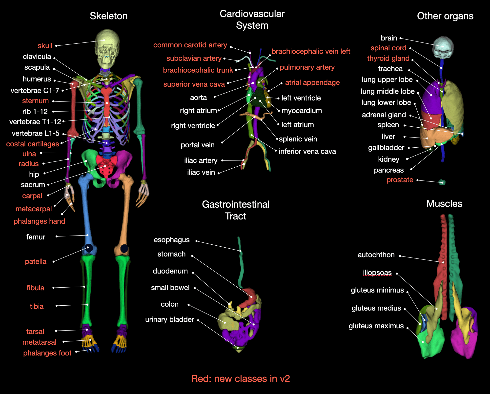
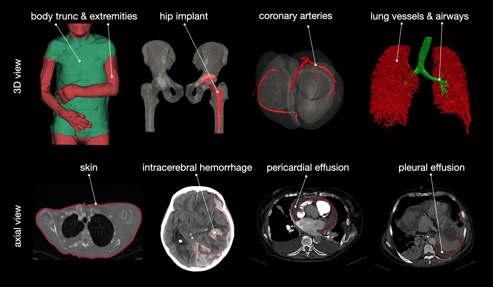

# TotalSegmentator

Tool for segmentation of over 117 classes in CT images. It was trained on a wide range of different CT images (different scanners, institutions, protocols,...) and therefore should work well on most images. A large part of the training dataset can be downloaded from [Zenodo](https://doi.org/10.5281/zenodo.6802613) (1228 subjects). You can also try the tool online at [totalsegmentator.com](https://totalsegmentator.com/).

**ANNOUNCEMENT: We recently released v2. See [changes and improvements](resources/improvements_in_v2.md).**



Created by the department of [Research and Analysis at University Hospital Basel](https://www.unispital-basel.ch/en/radiologie-nuklearmedizin/forschung-radiologie-nuklearmedizin).  
If you use it please cite our [Radiology AI paper](https://pubs.rsna.org/doi/10.1148/ryai.230024). Please also cite [nnUNet](https://github.com/MIC-DKFZ/nnUNet) since TotalSegmentator is heavily based on it.


### Installation

TotalSegmentator works on Ubuntu, Mac and Windows and on CPU and GPU.

Install dependencies:  
* Python >= 3.9
* [Pytorch](http://pytorch.org/) >= 1.12.1

Optionally:
* if you use the option `--preview` you have to install xvfb (`apt-get install xvfb`)


Install Totalsegmentator
```
pip install TotalSegmentator
```


### Usage
```
TotalSegmentator -i ct.nii.gz -o segmentations
```
> Note: A Nifti file or a folder with all DICOM slices of one patient is allowed as input

> Note: If you run on CPU use the option `--fast` or `--roi_subset` to greatly improve runtime.

> Note: This is not a medical device and not intended for clinical usage.


### Subtasks



Next to the default task (`total`) there are more subtasks with more classes:

Openly available for any usage:  
* **total**: default task containing 117 main classes (see [here](https://github.com/wasserth/TotalSegmentator#class-details) for list of classes)
* **lung_vessels**: lung_vessels (cite [paper](https://www.sciencedirect.com/science/article/pii/S0720048X22001097)), lung_trachea_bronchia
* **body**: body, body_trunc, body_extremities, skin
* **cerebral_bleed**: intracerebral_hemorrhage (cite [paper](https://www.mdpi.com/2077-0383/12/7/2631))*
* **hip_implant**: hip_implant*
* **coronary_arteries**: coronary_arteries*
* **pleural_pericard_effusion**: pleural_effusion (cite [paper](http://dx.doi.org/10.1097/RLI.0000000000000869)), pericardial_effusion (cite [paper](http://dx.doi.org/10.3390/diagnostics12051045))*

*: These models are not trained on the full totalsegmentator dataset but on some small other datasets. Therefore, expect them to work less robustly.

Available with a license (free licenses available for non-commercial usage [here](https://backend.totalsegmentator.com/license-academic/). For a commercial license contact jakob.wasserthal@usb.ch): 
* **heartchambers_highres**: myocardium, atrium_left, ventricle_left, atrium_right, ventricle_right, aorta, pulmonary_artery (trained on sub-millimeter resolution)
* **appendicular_bones**: patella, tibia, fibula, tarsal, metatarsal, phalanges_feet, ulna, radius, carpal, metacarpal, phalanges_hand
* **tissue_types**: subcutaneous_fat, skeletal_muscle, torso_fat
* **face**: face_region

Usage:
```
TotalSegmentator -i ct.nii.gz -o segmentations -ta <task_name>
```


### Advanced settings
* `--device`: Choose `cpu` or `gpu`
* `--fast`: For faster runtime and less memory requirements use this option. It will run a lower resolution model (3mm instead of 1.5mm). 
* `--roi_subset`: Takes a space separated list of class names (e.g. `spleen colon brain`) and only predicts those classes. Saves a lot of runtime and memory.
* `--preview`: This will generate a 3D rendering of all classes, giving you a quick overview if the segmentation worked and where it failed (see `preview.png` in output directory).
* `--ml`: This will save one nifti file containing all labels instead of one file for each class. Saves runtime during saving of nifti files. (see [here](https://github.com/wasserth/TotalSegmentator#class-details) for index to class name mapping).
* `--statistics`: This will generate a file `statistics.json` with volume (in mm³) and mean intensity of each class.
* `--radiomics`: This will generate a file `statistics_radiomics.json` with radiomics features of each class. You have to install pyradiomics to use this (`pip install pyradiomics`).


### Run via docker
We also provide a docker container which can be used the following way
```
docker run --gpus 'device=0' --ipc=host -v /absolute/path/to/my/data/directory:/tmp wasserth/totalsegmentator:2.0.0 TotalSegmentator -i /tmp/ct.nii.gz -o /tmp/segmentations
```


### Running v1
If you want to keep on using TotalSegmentator v1 (e.g. because you do not want to change your pipeline) you 
can install it with the following command:
```
pip install TotalSegmentator==1.5.7
```
The documentation for v1 can be found [here](https://github.com/wasserth/TotalSegmentator/tree/v1.5.7). Bugfixes for v1 are developed in the branch `v1_bugfixes`.
Our Radiology AI publication refers to TotalSegmentator v1. 


### Resource Requirements
Totalsegmentator has the following runtime and memory requirements (using a Nvidia RTX 3090 GPU):  
(1.5mm is the normal model and 3mm is the `--fast` model. With v2 the runtimes have increased a bit since
we added more classes.)


If you want to reduce memory consumption you can use the following options:
* `--fast`: This will use a lower resolution model
* `--body_seg`: This will crop the image to the body region before processing it
* `--roi_subset <list of classes>`: This will only predict a subset of classes
* `--force_split`: This will split the image into 3 parts and process them one after another
* `--nr_thr_saving 1`: Saving big images with several threads will take a lot of memory


### Train / validation / test split
The exact split of the dataset can be found in the file `meta.csv` inside of the [dataset](https://doi.org/10.5281/zenodo.6802613). This was used for the validation in our paper.  
The exact numbers of the results for the high resolution model (1.5mm) can be found [here](resources/results_all_classes_v1.json). The paper shows these numbers in the supplementary materials figure 11. 


### Retrain model and run evaluation
See [here](resources/train_nnunet.md) for more infos how to train a nnU-Net yourself on the TotalSegmentator dataset, how to split the data into train/validation/test set like in our paper and how to run the same evaluation as in our paper.


### Other commands
If you want to combine some subclasses (e.g. lung lobes) into one binary mask (e.g. entire lung) you can use the following command:
```
totalseg_combine_masks -i totalsegmentator_output_dir -o combined_mask.nii.gz -m lung
```

Normally weights are automatically downloaded when running TotalSegmentator. If you want to download the weights with an etxra command (e.g. when building a docker container) use this: 
```
totalseg_download_weights -t <task_name>
```

After acquiring a license number for the non-open tasks you can set it with the following command:
```
totalseg_set_license -l aca_12345678910
```

### Python API
You can run totalsegmentator via python:
```python
from totalsegmentator.python_api import totalsegmentator

totalsegmentator(input_path, output_path)
```
You can see all available arguments [here](https://github.com/wasserth/TotalSegmentator/blob/master/totalsegmentator/python_api.py).


### Install latest master branch (contains latest bug fixes)
```
pip install git+https://github.com/wasserth/TotalSegmentator.git
```


### Typical problems
When you get the following error message
```
ITK ERROR: ITK only supports orthonormal direction cosines. No orthonormal definition found!
```
you should do
```
pip install SimpleITK==2.0.2
```


### Other
TotalSegmentator sends anonymous usage statistics to help us improve it further. You can deactivate it by setting `send_usage_stats` to `false` in `~/.totalsegmentator/config.json`.


### Reference 
For more details see our [Radiology AI paper](https://pubs.rsna.org/doi/10.1148/ryai.230024) ([freely available preprint](https://arxiv.org/abs/2208.05868)).
If you use this tool please cite it as follows
```
Wasserthal, J., Breit, H.-C., Meyer, M.T., Pradella, M., Hinck, D., Sauter, A.W., Heye, T., Boll, D., Cyriac, J., Yang, S., Bach, M., Segeroth, M., 2023. TotalSegmentator: Robust Segmentation of 104 Anatomic Structures in CT Images. Radiology: Artificial Intelligence. https://doi.org/10.1148/ryai.230024
```
Please also cite [nnUNet](https://github.com/MIC-DKFZ/nnUNet) since TotalSegmentator is heavily based on it.  
Moreover, we would really appreciate if you let us know what you are using this tool for. You can also tell us what classes we should add in future releases. You can do so [here](https://github.com/wasserth/TotalSegmentator/issues/1).


### Class details

The following table shows a list of all classes.

TA2 is a standardised way to name anatomy. Mostly the TotalSegmentator names follow this standard. 
For some classes they differ which you can see in the table below.

[Here](resources/totalsegmentator_snomed_mapping.csv) you can find a mapping of the TotalSegmentator classes to SNOMED-CT codes.

|Index|TotalSegmentator name|TA2 name|
|:-----|:-----|:-----|
1 | spleen ||
2 | kidney_right ||
3 | kidney_left ||
4 | gallbladder ||
5 | liver ||
6 | stomach ||
7 | pancreas ||
8 | adrenal_gland_right | suprarenal gland |
9 | adrenal_gland_left | suprarenal gland |
10 | lung_upper_lobe_left | superior lobe of left lung |
11 | lung_lower_lobe_left | inferior lobe of left lung |
12 | lung_upper_lobe_right | superior lobe of right lung |
13 | lung_middle_lobe_right | middle lobe of right lung |
14 | lung_lower_lobe_right | inferior lobe of right lung |
15 | esophagus ||
16 | trachea ||
17 | thyroid_gland ||
18 | small_bowel | small intestine |
19 | duodenum ||
20 | colon ||
21 | urinary_bladder ||
22 | prostate ||
23 | kidney_cyst_left ||
24 | kidney_cyst_right ||
25 | sacrum ||
26 | vertebrae_S1 ||
27 | vertebrae_L5 ||
28 | vertebrae_L4 ||
29 | vertebrae_L3 ||
30 | vertebrae_L2 ||
31 | vertebrae_L1 ||
32 | vertebrae_T12 ||
33 | vertebrae_T11 ||
34 | vertebrae_T10 ||
35 | vertebrae_T9 ||
36 | vertebrae_T8 ||
37 | vertebrae_T7 ||
38 | vertebrae_T6 ||
39 | vertebrae_T5 ||
40 | vertebrae_T4 ||
41 | vertebrae_T3 ||
42 | vertebrae_T2 ||
43 | vertebrae_T1 ||
44 | vertebrae_C7 ||
45 | vertebrae_C6 ||
46 | vertebrae_C5 ||
47 | vertebrae_C4 ||
48 | vertebrae_C3 ||
49 | vertebrae_C2 ||
50 | vertebrae_C1 ||
51 | heart ||
52 | aorta ||
53 | pulmonary_vein ||
54 | brachiocephalic_trunk ||
55 | subclavian_artery_right ||
56 | subclavian_artery_left ||
57 | common_carotid_artery_right ||
58 | common_carotid_artery_left ||
59 | brachiocephalic_vein_left ||suprarenal gland
60 | brachiocephalic_vein_right ||
61 | atrial_appendage_left ||
62 | superior_vena_cava ||
63 | inferior_vena_cava ||
64 | portal_vein_and_splenic_vein | hepatic portal vein |
65 | iliac_artery_left | common iliac artery |
66 | iliac_artery_right | common iliac artery |
67 | iliac_vena_left | common iliac vein |
68 | iliac_vena_right | common iliac vein |
69 | humerus_left ||
70 | humerus_right ||
71 | scapula_left ||
72 | scapula_right ||
73 | clavicula_left | clavicle |
74 | clavicula_right | clavicle |
75 | femur_left ||
76 | femur_right ||
77 | hip_left ||
78 | hip_right ||
79 | spinal_cord ||
80 | gluteus_maximus_left | gluteus maximus muscle |
81 | gluteus_maximus_right | gluteus maximus muscle |
82 | gluteus_medius_left | gluteus medius muscle |
83 | gluteus_medius_right | gluteus medius muscle |
84 | gluteus_minimus_left | gluteus minimus muscle |
85 | gluteus_minimus_right | gluteus minimus muscle |
86 | autochthon_left ||
87 | autochthon_right ||
88 | iliopsoas_left | iliopsoas muscle |
89 | iliopsoas_right | iliopsoas muscle |
90 | brain ||
91 | skull ||
92 | rib_right_4 ||
93 | rib_right_3 ||
94 | rib_left_1 ||
95 | rib_left_2 ||
96 | rib_left_3 ||
97 | rib_left_4 ||
98 | rib_left_5 ||
99 | rib_left_6 ||
100 | rib_left_7 ||
101 | rib_left_8 ||
102 | rib_left_9 ||
103 | rib_left_10 ||
104 | rib_left_11 ||
105 | rib_left_12 ||
106 | rib_right_1 ||
107 | rib_right_2 ||
108 | rib_right_5 ||
109 | rib_right_6 ||
110 | rib_right_7 ||
111 | rib_right_8 ||
112 | rib_right_9 ||
113 | rib_right_10 ||
114 | rib_right_11 ||
115 | rib_right_12 ||
116 | sternum ||
117 | costal_cartilages ||
