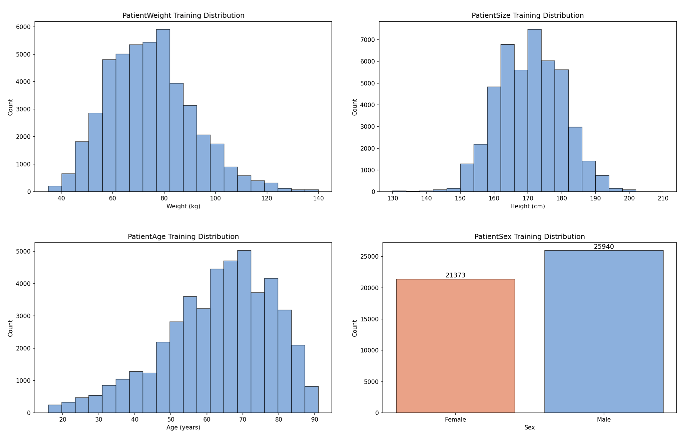

# Details on how the prediction of body size, weight, age and sex is done


TotalSegmentator is used to predict the following structures:
```python
organs = [
    'gluteus_maximus_left', 'hip_right', 'spinal_cord', 'heart', 'spleen', 'hip_left',
    'clavicula_left', 'scapula_left', 'gluteus_maximus_right', 'gallbladder', 'humerus_right',
    'gluteus_minimus_right', 'autochthon_left', 'gluteus_minimus_left', 'scapula_right',
    'femur_right', 'pancreas', 'prostate', 'aorta', 'liver', 'iliopsoas_left',
    'clavicula_right', 'brain', 'gluteus_medius_left', 'humerus_left', 'gluteus_medius_right',
    'kidney_left', 'femur_left', 'kidney_right', 'autochthon_right', 'iliopsoas_right',
    'lung_left', 'lung_right'
]

vertebrae = [
    'vertebrae_C1', 'vertebrae_C2', 'vertebrae_C3', 'vertebrae_C4', 'vertebrae_C5',
    'vertebrae_C6', 'vertebrae_C7', 'vertebrae_T1', 'vertebrae_T2', 'vertebrae_T3',
    'vertebrae_T4', 'vertebrae_T5', 'vertebrae_T6', 'vertebrae_T7', 'vertebrae_T8',
    'vertebrae_T9', 'vertebrae_T10', 'vertebrae_T11', 'vertebrae_T12', 'vertebrae_L1',
    'vertebrae_L2', 'vertebrae_L3', 'vertebrae_L4', 'vertebrae_L5'
]

tissue_types = ['subcutaneous_fat', 'torso_fat', 'skeletal_muscle']
```
For CT, the 5 lung lobes are combined into `lung_left` and `lung_right`. Additionally, for each tissue type a slice is extracted at each vertebra level (tissue_type × vertebra combinations).

Then the volume and median intensity (HU value) of each structure is used as feature for a xgboost classifier.

## Results

### CT

Training images: 46972 (images with abdomen OR thorax at least partially visible)  
Validation set: 16181 images (abdomen AND thorax at least partially visible)  
Test set: 501 CT images (hold-out)
    
| Target | Nr. training images | Nr. validation images | MAE on validation set | MAE on test set |
|--------|--------------------:|---------------------:|----------:|----------------:|
| Weight | 46972 | 16181 | 3.4 kg | 3.66 kg (stddev 4.91 kg) |
| Size   | 46972 | 16181 | 3.8 cm | 3.79 cm (stddev 3.34 cm) |
| Age    | 46972 | 16181 | 4.9 years | 5.56 years (stddev 5.36 years) |
| Sex    | 46972 | 16181 | F1: 0.995 | Accuracy: 0.972 |

### MR

Training images: 31901 (images with abdomen OR thorax at least partially visible)  
Validation set: 1145 images (abdomen AND thorax at least partially visible)
Test set: not available

| Target | Nr. training images | Nr. validation images | MAE on validation set | MAE on test set |
|--------|--------------------:|---------------------:|----------:|----------------:|
| Weight | 31901 | 1145 | 5.5 kg | — |
| Size   | 31901 | 1145 | 4.0 cm | — |
| Age    | 31901 | 1145 | 5.3 years | — |
| Sex    | 31901 | 1145 | F1: 0.901 | — |


## Info

**Do not use for age < 16 years, since the model was not trained on children.**

**The bigger the field of view the better the prediction (e.g. complete abdomen and thorax give a lot better results, than images with only the pelvis visible).**

The classifier is an ensemble of 5 models. The output contains the 
standard deviation of the predictions which can be used as a measure of confidence. If it is low the 5 models
give similar predictions which is a good sign.

The following plots show the distribution of the training data. If you try to predict cases out of this distribution, the model will likely not perform well.



## Limitations

The model was trained on clinical data. This makes the model more robust and more generalizable to other clinical settings (e.g. in contrast to a model trained on some population study like UK Biobank). However, sometimes the body weight and size are not exactly measured but only estimated when being added to the DICOM header by clinicians. This reduces the accuracy of the model.


## License of the body stats model

CC-BY-NC 4.0

