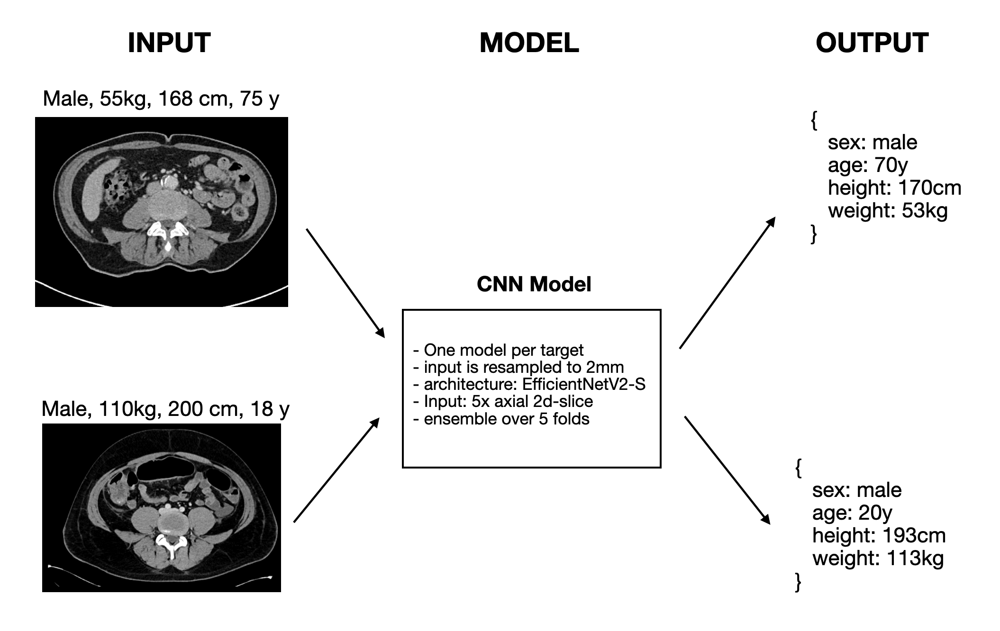
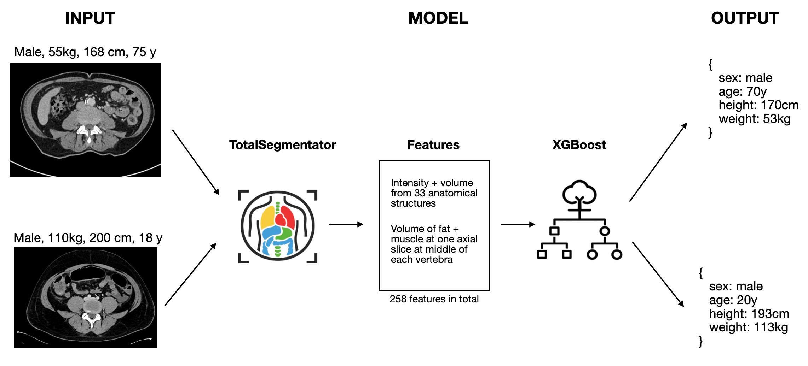

# Details on how the prediction of body size, weight, age and sex is done

## CNN Model (default)

The default model is a Convolutional Neural Network (CNN) using 5 axial 2d-slices sampled along the z-axis as input.



Details:

- Separate CNNs are trained for CT and MR, and for each target (weight, size, age, sex).
- The models are 2D EfficientNetV2-S (`tf_efficientnetv2_s.in21k`) networks.
- Input is 5 axial slices from the image, used as 5 input channels. The slices are evenly sampled along the z-axis.
- Images are resampled to 2 mm spacing, then center cropped/padded to 240 × 240 pixels for CT and 210 × 210 pixels for MR.
- Inference uses an ensemble of 5 folds; weight, size and age are regression tasks, while sex is a binary classification task.


## XGBoost Model

In addition we provide a second model which uses TotalSegmentator features + XGBoost. This is a slower and has lower accuracy. Therefore, this is only recommend as baseline or when the CNN model fails.



TotalSegmentator is used to predict the following structures:
```python
organs = [
    'gluteus_maximus_left', 'hip_right', 'spinal_cord', 'heart', 'spleen', 'hip_left',
    'clavicula_left', 'scapula_left', 'gluteus_maximus_right', 'gallbladder', 'humerus_right',
    'gluteus_minimus_right', 'autochthon_left', 'gluteus_minimus_left', 'scapula_right',
    'femur_right', 'pancreas', 'prostate', 'aorta', 'liver', 'iliopsoas_left',
    'clavicula_right', 'brain', 'gluteus_medius_left', 'humerus_left', 'gluteus_medius_right',
    'kidney_left', 'femur_left', 'kidney_right', 'autochthon_right', 'iliopsoas_right',
    'lung_left', 'lung_right'
]

vertebrae = [
    'vertebrae_C1', 'vertebrae_C2', 'vertebrae_C3', 'vertebrae_C4', 'vertebrae_C5',
    'vertebrae_C6', 'vertebrae_C7', 'vertebrae_T1', 'vertebrae_T2', 'vertebrae_T3',
    'vertebrae_T4', 'vertebrae_T5', 'vertebrae_T6', 'vertebrae_T7', 'vertebrae_T8',
    'vertebrae_T9', 'vertebrae_T10', 'vertebrae_T11', 'vertebrae_T12', 'vertebrae_L1',
    'vertebrae_L2', 'vertebrae_L3', 'vertebrae_L4', 'vertebrae_L5'
]

tissue_types = ['subcutaneous_fat', 'torso_fat', 'skeletal_muscle']
```
For CT, the 5 lung lobes are combined into `lung_left` and `lung_right`. Additionally, for each tissue type a slice is extracted at each vertebra level (tissue_type × vertebra combinations).

Then the volume and median intensity (HU value) of each structure is used as feature for a xgboost classifier.

NOTE: The XGBoost Model uses the `tissue_types` model which is only available with a license. You can get a license [here](https://backend.totalsegmentator.com/license-academic/) and set it via `-l <license_number>`.


## Number of training images:  

| Model    | CT     | MR     |
|----------|--------|--------|
| XGBoost  | 46972  | 31901  |
| CNN      | 57292  | 45544  |


## Results

For Weight, Size and Age the median absolute error is reported.
For Sex the Accuracy is reported.
Each shows the metric ± standard deviation.


### CT

#### Test set: 
- 501 CT images (hold-out)
- mix of different FOVs (thorax, abdomen, pelvis, whole body)

| Model | Weight | Size | Age | Sex |
|-------|--------|------|-----|-----|
| CNN | 3.52 ± 4.42 kg | 3.38 ± 3.41 cm | 4.02 ± 3.76 years | 0.99 ± 0.11 |
| XGBoost | 3.55 ± 4.76 kg | 3.53 ± 3.31 cm | 5.47 ± 5.31 years | 0.96 ± 0.19 |


#### External test set: 
- 54 CT images from [Spine-Mets-CT-SEG](https://www.cancerimagingarchive.net/collection/spine-mets-ct-seg/)

Thorax-abdomen-pelvis:

| Model | Weight | Size | Age | Sex |
|-------|--------|------|-----|-----|
| CNN | 4.52 ± 4.41 kg | 4.55 ± 3.92 cm | 4.90 ± 4.68 years | 0.91 ± 0.29 |
| XGBoost | 4.20 ± 5.46 kg | 3.85 ± 3.88 cm | 5.74 ± 5.36 years | 0.96 ± 0.19 |

Thorax-only:

| Model | Weight | Size | Age | Sex |
|-------|--------|------|-----|-----|
| CNN | 4.30 ± 6.10 kg | 5.43 ± 3.63 cm | 5.52 ± 6.89 years | 0.85 ± 0.36 |
| XGBoost | 6.58 ± 6.85 kg | 5.24 ± 4.84 cm | 10.51 ± 8.13 years | 0.87 ± 0.34 |

Abdomen-pelvis-only:

| Model | Weight | Size | Age | Sex |
|-------|--------|------|-----|-----|
| CNN | 3.64 ± 3.91 kg | 3.98 ± 3.86 cm | 5.76 ± 5.99 years | 0.98 ± 0.14 |
| XGBoost | 5.65 ± 7.61 kg | 5.52 ± 5.22 cm | 6.58 ± 6.44 years | 0.91 ± 0.29 |


### MR

#### Test set: 
- 636 MR images (hold-out)
- mix of different FOVs (thorax, abdomen, pelvis, whole body)

| Model | Weight | Size | Age | Sex |
|-------|--------|------|-----|-----|
| CNN | 3.02 ± 3.24 kg | 3.12 ± 3.07 cm | 4.21 ± 5.27 years | 0.98 ± 0.13 |
| XGBoost | 4.82 ± 7.60 kg | 4.05 ± 4.42 cm | 9.35 ± 8.71 years | 0.92 ± 0.28 |


### Runtime 

Runtime for 512x512x807 CT image on a Nvidia RTX 3090:

| Model | Time | RAM |
|-------|------|-----|
| XGBoost (GPU) | 133 s | 11.5 GB |
| XGBoost (CPU) | 872 s | 11.5 GB |
| CNN (GPU) | 38 s | 4.0 GB |
| CNN (CPU) | 37 s | 3.5 GB |


## Derived metrics

BMI and Body Surface Area (BSA) are calculated from the predicted weight and height values.

**BMI** uses the standard formula:

$$\text{BMI} = \frac{\text{weight (kg)}}{\text{height (m)}^2}$$

**BSA** uses the Mosteller formula:

$$\text{BSA (m}^2\text{)} = \sqrt{\frac{\text{height (cm)} \times \text{weight (kg)}}{3600}}$$


## Info

**Do not use for age < 16 years, since the model was not trained on children.**

**The bigger the field of view the better the prediction (e.g. complete abdomen and thorax give a lot better results, than images with only the pelvis visible).**

The classifier (both CNN and XGBoost) is an ensemble of 5 models. The output contains the 
standard deviation of the predictions which can be used as a measure of confidence. If it is low the 5 models
give similar predictions which is a good sign.

The following plots show the distribution of the training data. If you try to predict cases out of this distribution, the model will likely not perform well.


## Limitations

The model was trained on clinical data. This makes the model more robust and more generalizable to other clinical settings (e.g. in contrast to a model trained on some population study like UK Biobank). However, sometimes the body weight and size are not exactly measured but only estimated when being added to the DICOM header by clinicians. This reduces the accuracy of the model.
