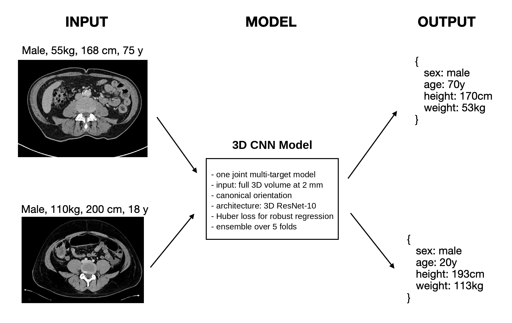
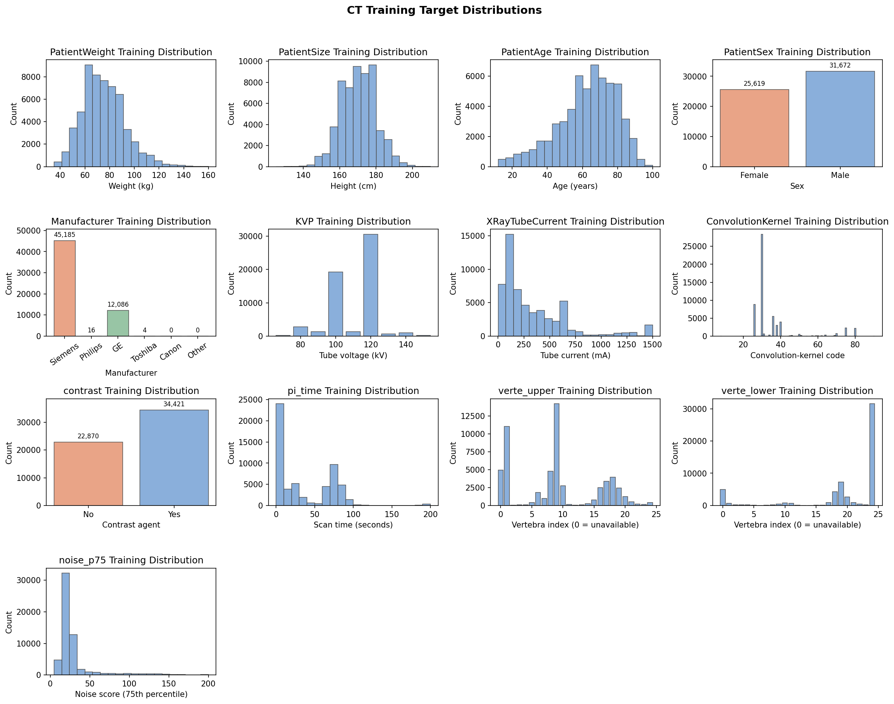
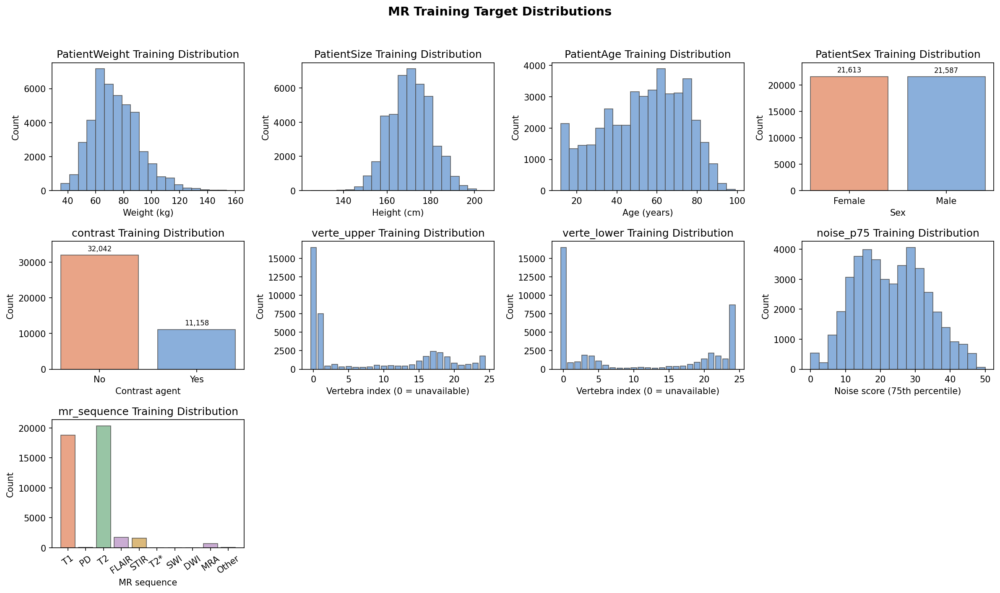

# Body statistics and acquisition-property prediction

## CNN Model

The default method uses one 3D CNN for CT and one for MR. Each model processes the complete resampled image volume and predicts all modality-specific targets in a single forward pass.

Both modalities predict:

- weight
- height (`size`)
- age
- sex

CT additionally predicts:

- scanner manufacturer
- tube voltage (`kvp`)
- tube current (`xray_tube_current`)
- vendor-harmonized convolution-kernel code (from 20 (soft / tissue) to 80 (hard / bone) kernels)
- contrast presence
- post-injection time
- cranial-most and caudal-most visible vertebral level (`verte_upper`, `verte_lower`)
- image-noise score

MR additionally reports:

- contrast presence
- cranial-most and caudal-most visible vertebral level
- image-noise score
- MR sequence class: T1, proton density, T2, FLAIR, STIR, T2*, susceptibility-weighted, diffusion-weighted, MR angiography, or other

BMI and body surface area are derived from predicted weight and height.

## Training data

The CNNs were trained on heterogeneous clinical examinations rather than one standardized acquisition protocol.

| Modality | Examinations | Patients |
|----------|-------------:|---------:|
| CT | 57,291 | 34,257 |
| MR | 43,200 | 29,073 |

### CT target distributions

### MR target distributions

## Results

Values below are mean absolute error (MAE) ± standard deviation. Sex is reported as F1 score. Classification targets in the additional-target table are F1 scores.

### CT

#### Internal test set

- 501 held-out CT examinations
- mixed fields of view

| Model | Weight | Size | Age | Sex |
|-------|--------|------|-----|-----|
| CNN | 3.90 ± 4.18 kg | 3.68 ± 2.86 cm | 4.42 ± 3.50 years | 0.990 |
| XGBoost | 4.90 ± 4.76 kg | 4.29 ± 3.31 cm | 6.60 ± 5.31 years | 0.969 |

#### Additional CT targets

| Target | Performance |
|--------|-------------|
| Manufacturer | 0.988 F1 |
| Tube voltage | 5.58 ± 6.72 kV |
| Tube current | 165.84 ± 223.64 mA |
| Convolution-kernel code | 2.29 ± 2.64 |
| Contrast presence | 0.963 F1 |
| Post-injection time | 5.36 ± 7.24 s |
| Cranial vertebral boundary | 0.75 ± 1.28 levels |
| Caudal vertebral boundary | 0.21 ± 0.45 levels |
| 75th-percentile noise score | 1.54 ± 1.91 |

#### External test set

- 54 CT examinations from [Spine-Mets-CT-SEG](https://www.cancerimagingarchive.net/collection/spine-mets-ct-seg/)

| Field of view | Model | Weight | Size | Age | Sex |
|---------------|-------|--------|------|-----|-----|
| Thorax–abdomen–pelvis | CNN | 4.45 ± 3.24 kg | 4.05 ± 2.82 cm | 5.17 ± 3.57 years | 0.971 |
| Thorax–abdomen–pelvis | XGBoost | 5.26 ± 5.35 kg | 4.64 ± 3.91 cm | 7.49 ± 5.39 years | 0.971 |
| Thorax only | CNN | 6.24 ± 5.26 kg | 4.83 ± 3.81 cm | 5.86 ± 4.73 years | 0.941 |
| Thorax only | XGBoost | 8.63 ± 6.90 kg | 6.05 ± 4.88 cm | 11.53 ± 8.18 years | 0.909 |
| Abdomen–pelvis | CNN | 3.78 ± 3.39 kg | 4.53 ± 3.04 cm | 5.39 ± 4.44 years | 0.972 |
| Abdomen–pelvis | XGBoost | 7.63 ± 7.61 kg | 6.48 ± 5.26 cm | 8.44 ± 6.45 years | 0.928 |

### MR

#### Internal test set

- 636 held-out MR examinations
- mixed fields of view

| Model | Weight | Size | Age | Sex |
|-------|--------|------|-----|-----|
| CNN | 4.34 ± 4.32 kg | 4.62 ± 3.61 cm | 7.13 ± 5.95 years | 0.970 |
| XGBoost | 7.08 ± 7.60 kg | 5.21 ± 4.42 cm | 11.46 ± 8.71 years | 0.932 |

#### Additional MR targets

| Target | Performance |
|--------|-------------|
| Contrast presence | 0.823 F1 |
| Cranial vertebral boundary | 2.83 ± 4.44 levels |
| Caudal vertebral boundary | 2.50 ± 4.51 levels |
| 75th-percentile noise score | 2.34 ± 2.15 |
| MR sequence | 0.953 micro-F1 |

### Runtime

Runtime covers preprocessing and the complete five-fold CNN ensemble on CPU.

| Modality and input shape | Time | Peak RAM |
|--------------------------|-----:|---------:|
| CT, 512 × 512 × 807 | 20 s | 3.8 GB |
| MR, 320 × 250 × 72 | 12 s | 1.7 GB |

## Derived metrics

BMI and Body Surface Area (BSA) are calculated from the predicted weight and height values.

**BMI** uses the standard formula:

$$\text{BMI} = \frac{\text{weight (kg)}}{\text{height (m)}^2}$$

**BSA** uses the Mosteller formula:

$$\text{BSA (m}^2\text{)} = \sqrt{\frac{\text{height (cm)} \times \text{weight (kg)}}{3600}}$$

## Limitations

**Do not use for age < 16 years, since the model was not trained on children.**

**Performance depends on the field of view. Very limited head, extremity, or small spine examinations may be unreliable.**

Weight and height predictions are intended for metadata plausibility checks, retrospective research, and approximate derived measures. They should not replace direct measurement when an error could affect high-risk dosing or ventilation settings. Predicted age is not suitable for forensic or legal age assessment.

The models were trained on heterogeneous clinical data, which improves coverage of routine acquisition variation. However, most ground truths came from DICOM metadata or automated algorithms and may be missing, estimated, outdated, or incorrect. Some uncommon acquisition classes are underrepresented.

External validation is currently limited to a relatively small CT cohort. Independent multicenter MR validation and broader external validation of the additional acquisition and quality-control targets are still needed.

## Technical details

### Architecture and preprocessing

- Model: 3D ResNet-10
- Images are converted to closest canonical orientation and resampled to 2 mm isotropic spacing.
- CT input is center cropped or padded to 240 × 240 × 240 voxels. CT intensities are clipped to the training-set 2nd–98th percentiles and normalized with training-set statistics.
- MR input is center cropped or padded to 210 × 210 × 150 voxels. Each MR volume is standardized individually.
- All continuous and encoded categorical targets are optimized jointly with Huber loss after fold-specific target standardization.
- The release model is an ensemble of five folds. Final values are means of the five denormalized predictions.
- CPU is sufficient for inference; no segmentation is required by the default CNN.

### Noise and coverage labels

Noise labels are generated from local 10 mm patches in TotalSegmentator tissue masks. A 3D affine intensity trend is removed from each patch, and residual noise is estimated robustly from the median absolute deviation.

- For CT, the score combines absolute residual noise from skeletal muscle, subcutaneous fat, and torso fat.
- For MR, residual noise is divided by local signal because MR intensity is arbitrarily scaled. Valid relative-noise patches are pooled across tissue regions.
- The CNN predicts the 75th percentile so that locally noisy image regions influence the score. Higher values indicate more noise.

Visible coverage is encoded using the cranial-most and caudal-most detected vertebra from C1 through L5. These outputs provide a compact indication of which part of the body is present in the image.

## XGBoost Model

An alternative model uses TotalSegmentator segmentations and XGBoost. It is slower, requires several segmentation steps, and had lower performance than the CNN for all four core targets in the current internal CT and MR test sets. It is mainly retained as a baseline or fallback.

TotalSegmentator provides organ, bone, vertebral, and tissue-compartment segmentations. Region volumes and median intensities, together with vertebral-level measurements of subcutaneous fat, torso fat, and skeletal muscle, are used as XGBoost features. Separate target-specific ensembles predict weight, height, age, and sex.

The XGBoost model uses the `tissue_types` task, which requires a license. An academic license is available [here](https://backend.totalsegmentator.com/license-academic/) and can be provided with `-l <license_number>`.
